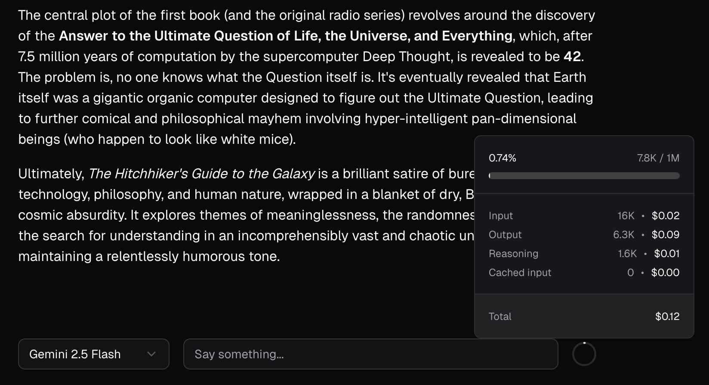

# AI SDK Token Usage



A lightweight Typescript library to track and visualize token usage across multiple AI model providers.

Built specifically for React and AI SDK.

## Installation

```bash
npm install ai-sdk-token-usage
```

## Getting Started

Read the [documentation](https://ai-sdk-token-usage.vercel.app) to learn how to integrate token tracking and 
cost visualization into your AI SDK projects. The demo app is also a good playground for trying out the hooks 
and seeing how usage data updates in real time.

## Basic Usage

Before using the hooks, make sure your messages include the required metadata. This allows 
AI SDK Token Usage to calculate costs and context window utilization.

### 1. Attach message metadata

In your API route (for example app/api/chat/route.ts), attach token usage metadata when returning the streamed response:

```ts
import { convertToModelMessages, gateway, streamText, type UIMessage } from 'ai';
import { toTokenUsageMetadata } from 'ai-sdk-token-usage/metadata';

export async function POST(req: Request) {
  const { messages, canonicalSlug }: { messages: UIMessage[]; canonicalSlug: string } = await req.json();

  const result = streamText({
    model: gateway(canonicalSlug),
    messages: convertToModelMessages(messages),
  });

  return result.toUIMessageStreamResponse({
    messageMetadata: ({ part }) => toTokenUsageMetadata({ part, canonicalSlug }),
  });
}
```

💡 If you already use custom metadata, see the [Advanced guide](https://ai-sdk-token-usage.vercel.app/docs/message-metadata#advanced) 
for how to extend your UIMessage type.

### 2. Visualize cost and context in your UI

Use the provided React hooks to access usage information anywhere in your app.

```tsx
import { useTokenCost, useTokenContext } from 'ai-sdk-token-usage';
import { useChat } from '@ai-sdk/react';

export default function Chat() {
  const { messages } = useChat();

  const context = useTokenContext({ messages, canonicalSlug: 'openai/gpt-5' });
  const cost = useTokenCost({ messages });

  if (context.isLoading || cost.isLoading) return <p>Loading...</p>;
  if (context.error || cost.error) return <p>An error occured.</p>

  return (
    <div>
      <p>Total cost: ${cost.data?.total.toFixed(5)}</p>
      <p>Context used: {context.data?.percentageUsed}%</p>
    </div>
  );
};
```

Both hooks follow the familiar SWR and React Query pattern — returning `{ data, isLoading, error }` —
so you can handle asynchronous state easily and integrate usage insights directly into your UI.

For more examples and advanced patterns, visit the [documentation](https://ai-sdk-token-usage.vercel.app).